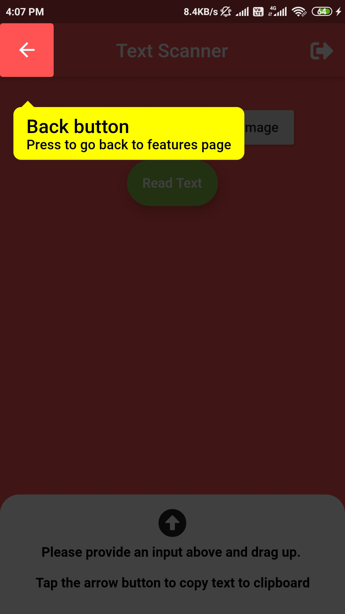

# knowurread

A Flutter application that helps you generate insights on your content.

▪ Text Scanning using Firebase ML vision kit.

▪ Features tour of the app whenever a new user downloads the app using shared preferences.

▪ Google Sign in, to have quick and secure registration and login of users.

▪ App apk download :-
https://drive.google.com/file/d/1C37sJfFw7VbO3OaiM-mEbTdu6BuzfE33/view?usp=sharing

               

                

        
